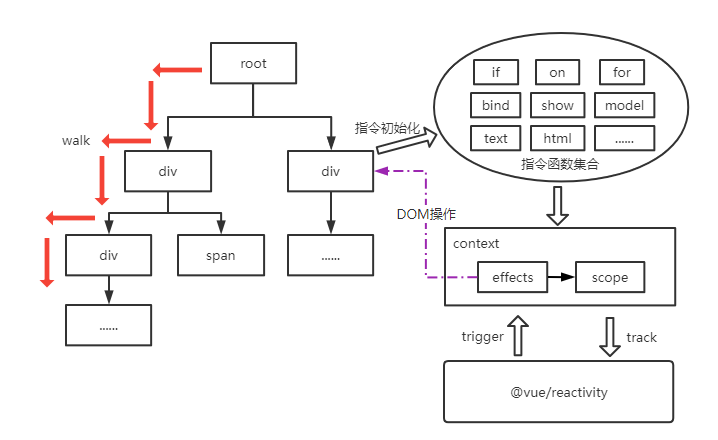

# 前言
前面花了五篇文章讲解petite-vue的指令和基础，我们得到一个可以跑得起来的轮子，今天想跳过这些语法与实现细节，从宏观的角度去窥探一下petite-vue的设计思路与流程控制的问题，5kb的一个库能涵盖vue的大部分特性，确实有些令人惊喜，下面就一层层剥开云雾吧。

# 模块组成
和vue类似，petite-vue也可以从三个方面来划分出基础模块；
1. 响应式

依赖@vue/reactivity模块实现数据自动追踪，当数据发生变化时，与数据关联的副作用函数会被重新触发；
2. 编译

petite-vue的编译相比vue来讲轻太多了，vue3自己实现了一套AST的解析与编译，而petite-vue则利用现有页面的DOM结构，petite-vue的编译主要集中在对DOM节点的遍历处理，初始化指令与上下文；
3. 渲染

petite-vue中是没有专门的renderer的，定位不同，因此不需要那么复杂，这里指的渲染基本都是在effect中操作DOM完成的；

# 运行流程


* 遍历DOM

以从根节点为起点，深度优先遍历所有节点，petite-vue通过walk和walkChildren完成这一阶段的工作，在遍历过程中，如果遇到对DOM结构有破坏性的指令(v-if/v-for)，则会先删除关联节点，然后通过副作用重构DOM结构；

* 指令初始化

当前遍历的节点如果有指令，则解析指令参数，然后交给对应的指令函数，例如v-if指令，就是交给if函数了，其中重要的一步就是将当前指令逻辑包裹在一个effect中，添加到调度器中的任务队列中等待执行，然后放入context.effects中，这样就建立了响应式基础；

* 调度

所有的effects的执行时机是由调度器(scheduler)控制的，在上一步中生成的effect都将放入scheduler中的队列中等待执行，执行完队列中的所有任务，清空队列，再追加任务执行；

* 副作用执行

副作用的执行由@vue/reactivity模块控制，当@vue/reactivity追踪的状态改变时，就会触发该状态对应的所有副作用函数执行，从而保证ui的更新，前面也说到副作用负责渲染工作，当然petite-vue里面没有专门的renderer，直接操作DOM，因此比较简单；

# context
context是一个比较重要的概念，是DOM与响应式之间的桥梁，先看一下context的数据结构：
```
export interface Context {
  key?: any
  scope: Record<string, any>
  dirs: Record<string, Directive>
  blocks: Block[]
  effect: typeof rawEffect
  effects: ReactiveEffect[]
  cleanups: (() => void)[]
}
```
* scope

scope保存了处于当前上下文中的所有指令能访问的状态对象，是通过@vue/reactivity包裹成Proxy对象的，这样修改scope的值，响应式系统就能触发注册的更新函数了。对于v-for指令，每一次循环其实都是一个相对独立的上下文(scopedContext)的，scopedContext的scope与parentContext.scope建立原型联系，这样能顺着原型链访问到我们期望的状态对象，这里的原型链关系其实也就对应着DOM的嵌套关系；

* dirs

保存所有自定义指令函数，当walk解析到一个指令属性时，首先会判断是否是内置指令，如果不是就会交给这里注册的dirs处理了；

* blocks

blocks存放block，block对象提供插入、删除、遍历子节点的功能，在petite-vue中，根节点、v-if、v-for三处使用了block对象，这里和vue3中的block差别较大，vue3中，block作为重要的性能优化手段，能减少diff比较次数，而在petite-vue中，则只是一个动态节点的管理对象，没有啥优化手段；

* effect

建立函数与响应式系统的关系，加入调度器等待执行，执行后scope与我们的函数就建立了响应同步机制；

* effects

保存所有副作用，当block移除时，每一个effect都需要解除与响应系统的绑定，执行其他结束工作；

* cleanups

这里就是当block移除的时候执行一些指令的清除工作，比如ref指令，需要删除scope.$refs对象上对DOM的引用关系；

# 最后
由于隐藏了响应式模块的实现，petite-vue本身的流程比较简单，因此感觉没太多可写的，本篇就作为petite-vue系列的完结篇，到此结束，后面将开始vue3的源码学习了。
